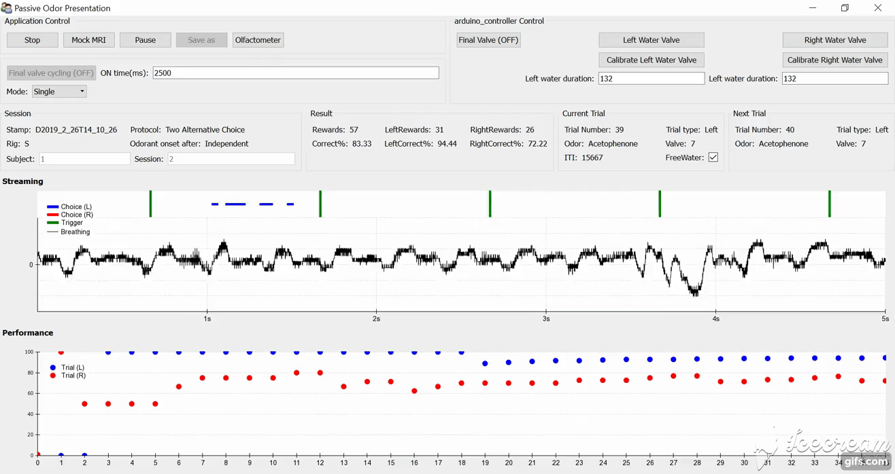
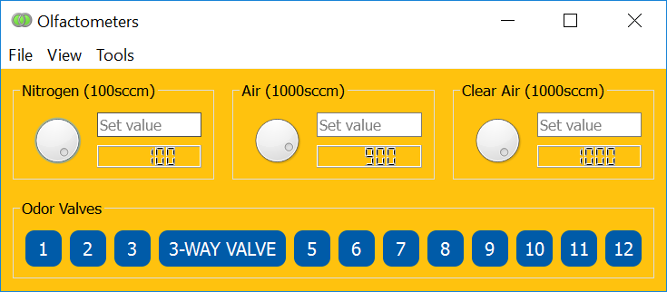

# PyOlfa
PyOlfa is a experimental tool for automated olfactory behavioral assessment. Here is a few examples of what PyOlfa can do:

*	Experimental control: Operate olfactometers and devices (sensors, valves, etc) connected to Arduino board.
*	Data acquisition: Stream subject’s responses and physiological measurements while the experiment is running
*	Real-time data visualization: Analyze the signals and display the behavioral results in real time 
*	Data storage: Store the data and parameters used in the experiments to a HDF5 file

# Dependencies
We recommend that you install a scientific Python distribution like Anaconda. Since it meets all the requirements of nilearn, it will save you time and trouble. PyOlfa is written in Python 2.7. Please make sure you install the correct version. In addition, the following software packages are required or PyOlfa will not work at all. 

*	Chaco
* Enable
*	Kiwisolver
*	Traits
*	Traitsui
* Pyface
*	Pyserial
*	Pyside
*	Pyqt4

# Example Useage

